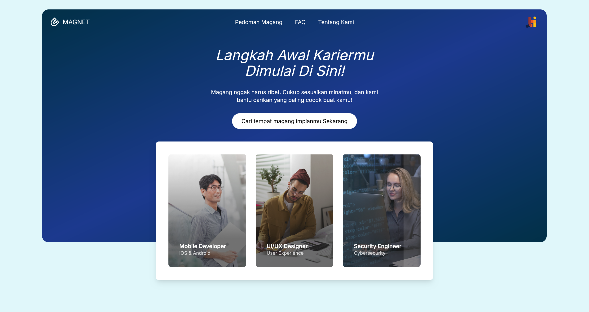

# MAGNET 🧲

[](https://github.com/topics/laravel)
[](https://github.com/topics/php)
[](https://github.com/topics/recommendation-system)
[](https://github.com/topics/internship)
[](https://github.com/topics/decision-making)
[](https://github.com/topics/roc)
[](https://github.com/topics/multimoora)



**MAGNET** is a smart platform designed to help college students discover the most suitable internship opportunities based on their individual preferences. This platform serves as a bridge between students and their ideal internship placements.

Users simply enter their preferences, and MAGNET works behind the scenes using **Decision Support System (DSS)** techniques to analyze the data and recommend the best-matched internships. The goal is to make the process as simple, efficient, and user-friendly as possible — so students can focus more on preparing for their careers, and less on finding opportunities.

Whether you're a student looking for a relevant experience or an institution aiming to help your students thrive, MAGNET is built to support you every step of the way.

---

## 📚 Documentation

- **[Project Structure](PROJECT_STRUCTURE.md)** - Detailed folder and file organization
- **[Quick Reference](QUICK_REFERENCE.md)** - Common commands cheat sheet
- **[Contributing Guide](CONTRIBUTING.md)** - How to contribute to the project
- **[Testing Guide](docs/testing/README.md)** - Complete testing documentation
- **[Website Preview](docs/web-preview/)** - Full website screenshots and UI preview

---

# How to clone the project 
1. Clone the project using Git

    ```bash
    git clone https://github.com/Maju-Lancar/MAGNET-Magang-Network-And-Tracking.git
    ```

2. Navigate to the project directory

    ```bash
    cd MAGNET-Magang-Network-And-Tracking
    ```

3. Install require dependencies

    Make sure you have [`Composer`](https://getcomposer.org/) and [`Node.js`](https://nodejs.org/en) installed on your computer. Then, run the following command:

    ```bash
    composer install && npm install
    ```

4. Create `.env` file

    Duplicate the `.env.example` file and rename the copy to `.env`. If your database has a password, make sure to update the `DB_PASSWORD` field in the `.env` file.

5. Generate the Laravel application key

    ```bash
    php artisan key:generate
    ```
    This will generate an `APP_KEY` and save it to the `.env` file.

6. Run database migration

    ```bash
    php artisan migrate
    ```
    This will set up your database schema.
   
---
# Our Team

<table>
    <thead>
        <tr>
            <td>GitHub Profile</td>
            <td>Name</td>
            <td>Role</td>
        </tr>
    </thead>
    <tbody>
        <tr>
            <td align="center">
                <a href="https://github.com/FarrelAD">
                    
                    <br>
                    
                </a>
            </td>
            <td>Farrel Augusta Dinata</td>
            <td>Project Manager, UI/UX Designer, Backend Developer</td>
        </tr>
        <tr>
            <td align="center">
                <a href="https://github.com/saalsabl">
                    
                    <br>
                    
                </a>
            </td>
            <td>Aaisyah Nursalsabil Ni Patriarti</td>
            <td>UI/UX Designer, Frontend Developer</td>
        </tr>
        <tr>
            <td align="center">
                <a href="https://github.com/AstorBoy11">
                    
                    <br>
                    
                </a>
            </td>
            <td>Aril Ibbet Ardana Putra</td>
            <td>Frontend Developer</td>
        </tr>
        <tr>
            <td align="center">
                <a href="https://github.com/Dimas0824">
                    
                    <br>
                    
                </a>
            </td>
            <td>Muhammad Irsyad Dimas Abdillah</td>
            <td>Database Designer, Backend Developer</td>
        </tr>
        <tr>
            <td align="center">
                <a href="https://github.com/vanstevanzaky">
                    
                    <br>
                    
                </a>
            </td>
            <td>Stevan Zaky Setyanto</td>
            <td>Frontend Developer</td>
        </tr>
    </tbody>
</table>

---

## 🧪 Testing

MAGNET menggunakan **Playwright** untuk End-to-End (E2E) testing.

### Quick Start Testing:

```bash
# Install dependencies (jika belum)
npm install

# Run test
npx playwright test

# Run test dengan browser visible
npx playwright test --headed

# Lihat report
npx playwright show-report
```

### 📚 Dokumentasi Testing Lengkap:

- **[Testing Guide](docs/testing/README.md)** - Panduan lengkap menjalankan test
- **[Playwright Documentation](docs/testing/PLAYWRIGHT_TESTING.md)** - Setup dan konfigurasi
- **Test Scripts:** Lihat folder `scripts/testing/` untuk helper scripts

### ✅ Test Status:

- **Mahasiswa Login:** ✅ 4/4 tests passed
- **Coverage:** Dashboard, Authentication, Navigation

---

---

